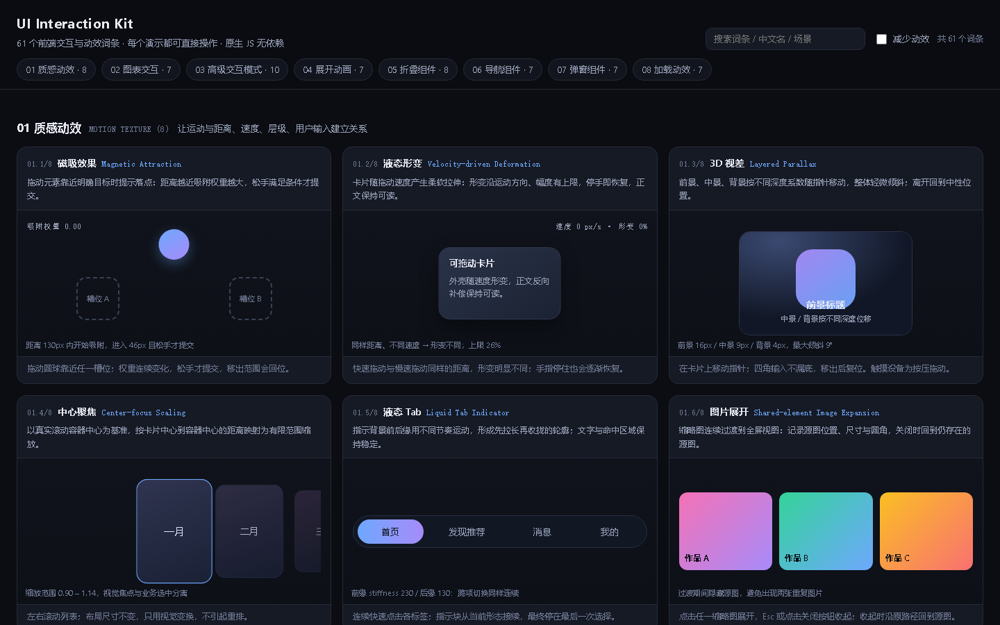

# UI Interaction Kit

**61 patterns** · **No dependencies** · **MIT License** · **CodeBuddy Skill**

> 让 AI 选对交互：8 种质感动效、7 种图表交互、10 种 App 模式、7 + 8 展开与折叠、7 种导航、7 种弹窗、7 种加载，共 61 个词条，每个词条都有可运行的 Demo。

**English version → [README_EN.md](./README_EN.md)** · **在线 Demo → https://alphaxe-hub.github.io/ui-interaction-kit/**



## 这是什么

把模糊的动效需求（"有质感""跟手""像液体""更高级"）翻译成 61 个已定义词条；让 AI 在动手前先选对一个，主交互一个就够。规则写进了 `SKILL.md`：**先理解任务 → 选一个主交互 → 再写代码**，描述任何交互必须写清触发、开始状态、变化过程、结束状态、取消状态。

## 一分钟安装

### CodeBuddy（已实测）

```bash
# 用户级（跨项目可用）
cp -r ui-interaction-kit ~/.codebuddy/skills/

# 项目级（仅当前项目）
mkdir -p .codebuddy/skills && cp -r ui-interaction-kit .codebuddy/skills/
```

### Claude Code / Cursor（SKILL.md 是通用 Agent Skills 格式，未实测）

```bash
# Claude Code
mkdir -p ~/.claude/skills && cp -r ui-interaction-kit ~/.claude/skills/

# Cursor（项目级）
mkdir -p .cursor/skills && cp -r ui-interaction-kit .cursor/skills/
```

## 触发词

当对话里出现下面这些词，AI 编码助手会自动调出本 Skill：

> 质感动效 · 有质感 · 更顺滑 · 跟手 · 像液体 · 磁吸 · 液态 · 回弹 · 视差 · 手势转场 · 动效优化 · 交互选型 · copyable prompt · 图表交互 · 展开动画 · 导航组件 · 弹窗 · 加载动效

## 61 个词条速览

<details>
<summary>01 质感动效 · Motion Texture（8）</summary>

| 英文 | 中文 | 一句话场景 |
|---|---|---|
| Magnetic Attraction | 磁吸效果 | 拖动元素靠近明确目标时提示落点 |
| Velocity-driven Deformation | 液态形变 | 卡片随拖动速度产生柔软拉伸 |
| Layered Parallax | 3D 视差 | 前景 / 中景 / 背景随输入产生深浅差异 |
| Center-focus Scaling | 中心聚焦 | 滚动浏览时突出当前居中项 |
| Liquid Tab Indicator | 液态 Tab | 选中背景在标签间伸缩流动 |
| Shared-element Image Expansion | 图片展开 | 缩略图连续扩展到全屏图 |
| Gesture-driven Transition | 手势转场 | 拖动控制页面切换，可取消 |
| Collision and Spring Response | 碰撞回弹 | 自由移动元素彼此碰撞推挤 |

</details>

<details>
<summary>02 图表交互 · Chart Interaction（7）</summary>

| 英文 | 中文 | 一句话场景 |
|---|---|---|
| Brush Selection | 框选 | 选择特定时间或数据范围 |
| Crosshair | 十字线 | 对齐数据点并查看对应数值 |
| Data Point Highlight | 数据点高亮 | 强调某个特定或重要的数据点 |
| Tooltip | 数据提示框 | 查看某个数据点的详细信息 |
| Legend Filter | 图例筛选 | 显示、隐藏或比较不同数据系列 |
| Zoom | 图表缩放 | 覆盖较大范围时查看局部趋势 |
| Drill Down | 数据下钻 | 从汇总数据进入更详细层级 |

</details>

<details>
<summary>03 高级交互模式 · App Interaction Patterns（10）</summary>

| 英文 | 中文 | 一句话场景 |
|---|---|---|
| Radial Theme Transition | 圆形主题切换 | 以点击位置为圆心切换两套主题 |
| Drag-to-Reorder | 拖拽排序 | 拖动列表项重新决定顺序 |
| Staggered Bulk Selection | 批量勾选 | 全选时多条内容依次进入选中态 |
| Velocity-Based Slider Snap | 滑杆惯性吸附 | 释放后短距离冲过再回最近刻度 |
| Animated Text Disclosure | 文本展开 | 按真实高度连续过渡 |
| Spring Stepper Progress | 步骤条回弹 | 进度段略微过冲再回准确位置 |
| Ripple Feedback for Related Switches | 开关联动反馈 | 切换一个开关，邻近的轻微涟漪 |
| Curved Card Deletion | 卡片曲线删除 | 滑过阈值后沿曲线飞向回收区 |
| Stacked Card Scroll | 卡片堆叠滚动 | 顶部卡片固定，后续压成一摞 |
| Expanding Tag Selection | 标签挤开 | 选中放大，邻近向两侧让位 |

</details>

<details>
<summary>04 展开动画 · Expand Animations（7）</summary>

Circle to Pill 圆点变胶囊 · Pill to Card 胶囊变信息卡 · Compact to Expand 紧凑态展开 · Corner Radius Morph 圆角形态过渡 · Size Morph 尺寸变形 · Content Reflow 内容重排 · Reverse Collapse 反向收回

</details>

<details>
<summary>05 折叠组件 · Collapse Components（8）</summary>

Accordion 手风琴 · Collapse 独立折叠 · Dropdown 下拉展开 · Treeview 树形 · Expandable Card 可展开卡片 · Sidebar 侧边栏 · Radio Menu 环形菜单 · Container Transform 容器变形

</details>

<details>
<summary>06 导航组件 · Navigation（7）</summary>

Tabs 标签页 · Segment Control 分段控件 · Breadcrumb 面包屑 · Pagination 分页 · Stepper 步骤条 · Sidebar 侧边导航 · Bottom Navigation 底部导航

</details>

<details>
<summary>07 弹窗组件 · Overlays（7）</summary>

Tooltip 文字提示 · Popover 气泡卡片 · Dropdown Menu 下拉菜单 · Drawer 抽屉 · Bottom Sheet 底部面板 · Modal 模态框 · Toast 轻提示（补充）

</details>

<details>
<summary>08 加载动效 · Loading States（7）</summary>

Page Loader 整页加载 · Skeleton 骨架屏 · Shimmer 微光扫过 · Spinner 旋转指示器 · Progress Bar 进度条 · Circular Progress 环形进度 · Button Loader 按钮加载

</details>

## Demo：61 个可操作示例

**在线体验（GitHub Pages，无需安装）**：https://alphaxe-hub.github.io/ui-interaction-kit/

本地运行：

```bash
# 方式一：直接双击打开（脚本非 module，file:// 可用）
open assets/showcase/index.html       # macOS
start assets/showcase/index.html      # Windows
explorer assets/showcase/index.html   # Git Bash

# 方式二：起一个本地服务器（推荐，方便分享）
npx serve assets/showcase
# 或
python3 -m http.server 8000 --directory assets/showcase
```

打开后右上角有"减少动效"开关，每个词条一张卡片，卡片内可真实操作。顶部搜索框按英文名 / 中文名 / 场景关键词过滤。

## 使用示例

### 直接发给 AI 的中文请求

> 帮我看一下这个可拖动卡片：拖得越快形变越明显，停手时逐渐恢复，正文保持清晰，再次拖动从当前状态接续。

> 把当前导航的选中背景做成液态 Tab：移动时先拉长再收拢，文字不动，快速连续点击也能平滑到最后选中的位置。

> 这个页面的返回转场跟随手势：松手时结合距离、速度和方向决定完成还是取消，并保留普通返回按钮。

### 跨工具的英文 Copyable prompt

```
Use the selected interaction pattern in my existing interface.
Preserve the current visual style, layout language, and component
structure. Do not rewrite unrelated components. Implement the
trigger, state changes, start and end states, motion behavior,
responsive behavior, keyboard accessibility, touch support, and
reduced-motion fallback described below:
[Insert the selected English interaction prompt here]
```

完整英文 prompt 模板见 [`references/prompt-templates.md`](./references/prompt-templates.md)。

## 目录结构

```
ui-interaction-kit/
├── SKILL.md                    # 决策入口：四步工作流 + 61 词条索引
├── references/                 # 每个分类的规则、验收清单、Copyable prompt
│   ├── 01-motion-texture.md    # 8 种质感动效
│   ├── 02-chart-interaction.md # 7 种图表交互
│   ├── 03-app-patterns.md      # 10 种 App 模式 + 英文 prompt
│   ├── 04-expand-collapse.md   # 7 + 8 展开与折叠
│   ├── 05-navigation.md        # 7 种导航
│   ├── 06-overlays.md          # 7 种弹窗
│   ├── 07-loading.md           # 7 种加载
│   └── prompt-templates.md     # 统一提示词模板
├── assets/showcase/            # Demo
│   ├── index.html
│   ├── core.js                 # 注册表 + 运行时 + reduced-motion 开关
│   ├── styles.css
│   └── demos/01..08-*.js       # 8 个分类共 61 个 demo
├── docs/demo-overview.png      # README 用的首屏截图
└── LICENSE                     # MIT
```

## 注意事项

- **不堆叠**：默认一个需求只选一个主交互；需要两层时拆主 + 辅并说明关系。
- **不堆"高级"**：把"有质感""跟手""像液体"翻译成具体的状态变化、位置变化、尺寸变化，不要直接当完整需求。
- **参数是设计选择**：本 Skill 列出的弹簧刚度、阈值、过冲量都是需要结合项目调整的设计选择，不是固定行业标准。
- **reduced-motion**：Demo 与所有 reference 都尊重 `prefers-reduced-motion`；真实项目里必须保留静态替代。
- **平台差异**：网页 / 原生 App / 小程序不默认使用同一套实现；先检查目标平台能力，与系统手势、返回、滚动冲突时优先协调现有行为。
- **不承诺帧率**：实际性能依赖设备和实现细节，编译通过不能替代真实交互验收。
- **不堆库**：不要为装饰效果引入完整物理引擎、动画库或路由框架，必要时优先用项目已有的依赖。

## 贡献指南

新增词条：

1. 在 `references/` 下新建 `XX-name.md`，覆盖选型边界、必须保留的规则、验收清单、Copyable prompt。
2. 在 `assets/showcase/demos/` 下加文件，调用 `UIK.register(catId, def)` 注册。
3. 在 `SKILL.md` 的词条总索引里加一行。

修改 Demo：

- 保持 8 个分类的注册文件结构。
- `node --check assets/showcase/demos/*.js` 全部通过。
- 打开 `assets/showcase/index.html` 实测正常交互再提交。
- 开启右上角"减少动效"开关复验静态降级。

## License

MIT © 2026 ChangerXu
