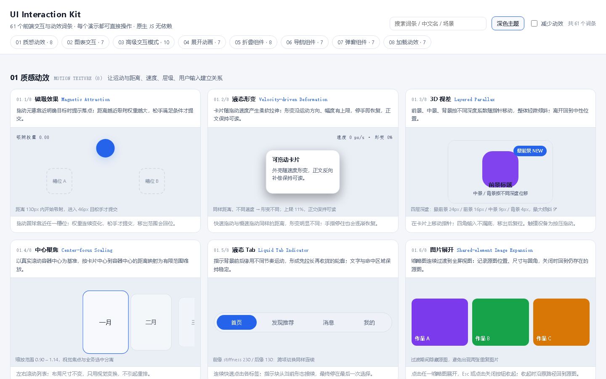

# UI Interaction Kit

**61 patterns** · **No dependencies** · **MIT License** · **CodeBuddy Skill**

> Pick the right interaction before writing a line of code. 8 motion textures, 7 chart interactions, 10 app patterns, 7 + 8 expand & collapse, 7 navigation, 7 overlays, 7 loading states — 61 entries, each with a runnable demo.

**中文版 → [README.md](./README.md)** · **Live demo → https://alphaxe-hub.github.io/ui-interaction-kit/**

<p>
  
  
</p>

## What it is

A selection-and-implementation knowledge base for front-end interactions. Turns vague asks like *"make it feel snappier"*, *"follow my finger"*, *"like liquid"* into 61 well-defined terms so the AI picks the right one before touching code. The rule baked into `SKILL.md` is simple: **understand the task → choose one interaction → then code**. Every interaction spec must cover trigger, start state, motion, end state, and cancel state.

## Install in one minute

### CodeBuddy (verified)

```bash
# User scope (shared across projects)
cp -r ui-interaction-kit ~/.codebuddy/skills/

# Project scope (current repo only)
mkdir -p .codebuddy/skills && cp -r ui-interaction-kit .codebuddy/skills/
```

### Claude Code / Cursor (same `SKILL.md` format, unverified)

```bash
# Claude Code
mkdir -p ~/.claude/skills && cp -r ui-interaction-kit ~/.claude/skills/

# Cursor (project scope)
mkdir -p .cursor/skills && cp -r ui-interaction-kit .cursor/skills/
```

## Trigger words

When the conversation contains any of these, the AI coding assistant will pull this Skill in:

> motion texture · feel snappier · smoother · follow my finger · liquid · magnetic · spring · parallax · gesture transition · animation tuning · interaction selection · copyable prompt · chart interaction · expand animation · navigation component · overlay · loading state

## 61-entry catalog

<details>
<summary>01 Motion Texture (8)</summary>

| English | Chinese | One-line scenario |
|---|---|---|
| Magnetic Attraction | 磁吸效果 | Drag an element near a target and signal the drop point |
| Velocity-driven Deformation | 液态形变 | Card deforms with drag speed, springs back on release |
| Layered Parallax | 3D 视差 | Foreground / midground / background shift with input |
| Center-focus Scaling | 中心聚焦 | The centered card visually pops during scroll |
| Liquid Tab Indicator | 液态 Tab | Indicator stretches then contracts between labels |
| Shared-element Image Expansion | 图片展开 | Thumbnail morphs into fullscreen image |
| Gesture-driven Transition | 手势转场 | Drag-controlled page transition, cancellable |
| Collision and Spring Response | 碰撞回弹 | Free-floating elements push each other on contact |

</details>

<details>
<summary>02 Chart Interaction (7)</summary>

| English | Chinese | One-line scenario |
|---|---|---|
| Brush Selection | 框选 | Select a time or data range |
| Crosshair | 十字线 | Align with data points and read values |
| Data Point Highlight | 数据点高亮 | Emphasize a specific or important data point |
| Tooltip | 数据提示框 | Inspect the details of a data point |
| Legend Filter | 图例筛选 | Show, hide or compare series |
| Zoom | 图表缩放 | Inspect a slice of a wide range |
| Drill Down | 数据下钻 | Move from summary to a finer level |

</details>

<details>
<summary>03 App Interaction Patterns (10)</summary>

| English | Chinese | One-line scenario |
|---|---|---|
| Radial Theme Transition | 圆形主题切换 | Reveal a new theme from the click point |
| Drag-to-Reorder | 拖拽排序 | Reorder list items by dragging |
| Staggered Bulk Selection | 批量勾选 | Select all with a staggered visual sweep |
| Velocity-Based Slider Snap | 滑杆惯性吸附 | Overshoot then snap to the nearest tick |
| Animated Text Disclosure | 文本展开 | Expand to real content height continuously |
| Spring Stepper Progress | 步骤条回弹 | Progress segment overshoots and settles |
| Ripple Feedback for Related Switches | 开关联动反馈 | Ripple to neighbors without changing their state |
| Curved Card Deletion | 卡片曲线删除 | Swiped card flies to trash along a curve |
| Stacked Card Scroll | 卡片堆叠滚动 | Previous cards compress into a visible stack |
| Expanding Tag Selection | 标签挤开 | Active tag grows, neighbors slide aside |

</details>

<details>
<summary>04 Expand Animations (7)</summary>

Circle to Pill · Pill to Card · Compact to Expand · Corner Radius Morph · Size Morph · Content Reflow · Reverse Collapse

</details>

<details>
<summary>05 Collapse Components (8)</summary>

Accordion · Collapse · Dropdown · Treeview · Expandable Card · Sidebar · Radio Menu · Container Transform

</details>

<details>
<summary>06 Navigation (7)</summary>

Tabs · Segment Control · Breadcrumb · Pagination · Stepper · Sidebar · Bottom Navigation

</details>

<details>
<summary>07 Overlays (7)</summary>

Tooltip · Popover · Dropdown Menu · Drawer · Bottom Sheet · Modal · Toast (addendum)

</details>

<details>
<summary>08 Loading States (7)</summary>

Page Loader · Skeleton · Shimmer · Spinner · Progress Bar · Circular Progress · Button Loader

</details>

## Demo: 61 playable examples

**Live demo (GitHub Pages, nothing to install)**: https://alphaxe-hub.github.io/ui-interaction-kit/

Toggle dark / light theme from the top-right button (the choice is remembered); use the "Reduce motion" switch to check the static fallback.

Run locally:

```bash
# Option 1: open directly (scripts are not ES modules, file:// works)
open assets/showcase/index.html       # macOS
start assets/showcase/index.html      # Windows
explorer assets/showcase/index.html   # Git Bash

# Option 2: serve locally (recommended for sharing)
npx serve assets/showcase
# or
python3 -m http.server 8000 --directory assets/showcase
```

Each card in the demo is one entry. Use the top-right *Reduce motion* toggle to verify the static fallback. The search box filters by English name, Chinese name, or scenario keyword.

## Usage examples

### Paste-ready Chinese requests

> Look at this draggable card: the faster I drag, the more it deforms; when I stop, it gradually recovers; the text stays readable; and when I grab it again it picks up from the current shape.

> Make the nav indicator a Liquid Tab: it should stretch first then contract when moving, the text should not move, and rapid consecutive clicks should still land smoothly on the last choice.

> The back transition on this page should follow the finger: on release, decide commit or cancel from distance, velocity, and direction, and keep the regular back button as a fallback.

### Cross-tool English copyable prompt

```
Use the selected interaction pattern in my existing interface.
Preserve the current visual style, layout language, and component
structure. Do not rewrite unrelated components. Implement the
trigger, state changes, start and end states, motion behavior,
responsive behavior, keyboard accessibility, touch support, and
reduced-motion fallback described below:
[Insert the selected English interaction prompt here]
```

Full prompt templates: [`references/prompt-templates.md`](./references/prompt-templates.md).

## Layout

```
ui-interaction-kit/
├── SKILL.md                    # Decision entry: 4-step workflow + 61-entry index
├── references/                 # Rules, acceptance checks, copyable prompts
│   ├── 01-motion-texture.md    # 8 motion textures
│   ├── 02-chart-interaction.md # 7 chart interactions
│   ├── 03-app-patterns.md      # 10 app patterns + English prompts
│   ├── 04-expand-collapse.md   # 7 + 8 expand & collapse
│   ├── 05-navigation.md        # 7 navigation components
│   ├── 06-overlays.md          # 7 overlays
│   ├── 07-loading.md           # 7 loading states
│   └── prompt-templates.md     # Unified prompt templates
├── assets/showcase/            # Demo
│   ├── index.html
│   ├── core.js                 # Registry + runtime + reduced-motion toggle
│   ├── styles.css
│   └── demos/01..08-*.js       # 8 files, 61 demos
├── docs/demo-overview.png      # Screenshot for this README
└── LICENSE                     # MIT
```

## Constraints

- **Don't stack**: pick one main interaction per request. If two are truly needed, split into primary + secondary and explain the relation.
- **Don't say "more advanced"**: translate *"snappier"*, *"follow my finger"*, *"like liquid"* into concrete state, position, and size changes.
- **Parameters are design choices**: the spring stiffness, thresholds, and overshoot values in this Skill are starting points, not industry standards — tune per project.
- **Respect `prefers-reduced-motion`**: both the demo and the reference docs assume it; your implementation must keep a static fallback.
- **Platform differences**: web, native app, and mini-program each need their own implementation. Check platform capabilities first and coordinate with system gestures, back, and scroll when in conflict.
- **No frame-rate promises**: real performance depends on device and implementation. Passing a build does not replace a real interaction test.
- **No bloat**: don't pull in a full physics engine, animation library, or routing framework for a decorative effect. Use what the project already has.

## Contributing

Add an entry:

1. New `references/XX-name.md` covering selection boundaries, must-keep rules, acceptance checks, and a copyable prompt.
2. Add a file under `assets/showcase/demos/` and register it with `UIK.register(catId, def)`.
3. Add a row to the index in `SKILL.md`.

Modify the demo:

- Keep the 8-category registration shape.
- `node --check assets/showcase/demos/*.js` must all pass.
- Open `assets/showcase/index.html` and verify the interaction in a real browser before committing.
- Toggle *Reduce motion* to verify the static fallback.

## License

MIT © 2026 ChangerXu
